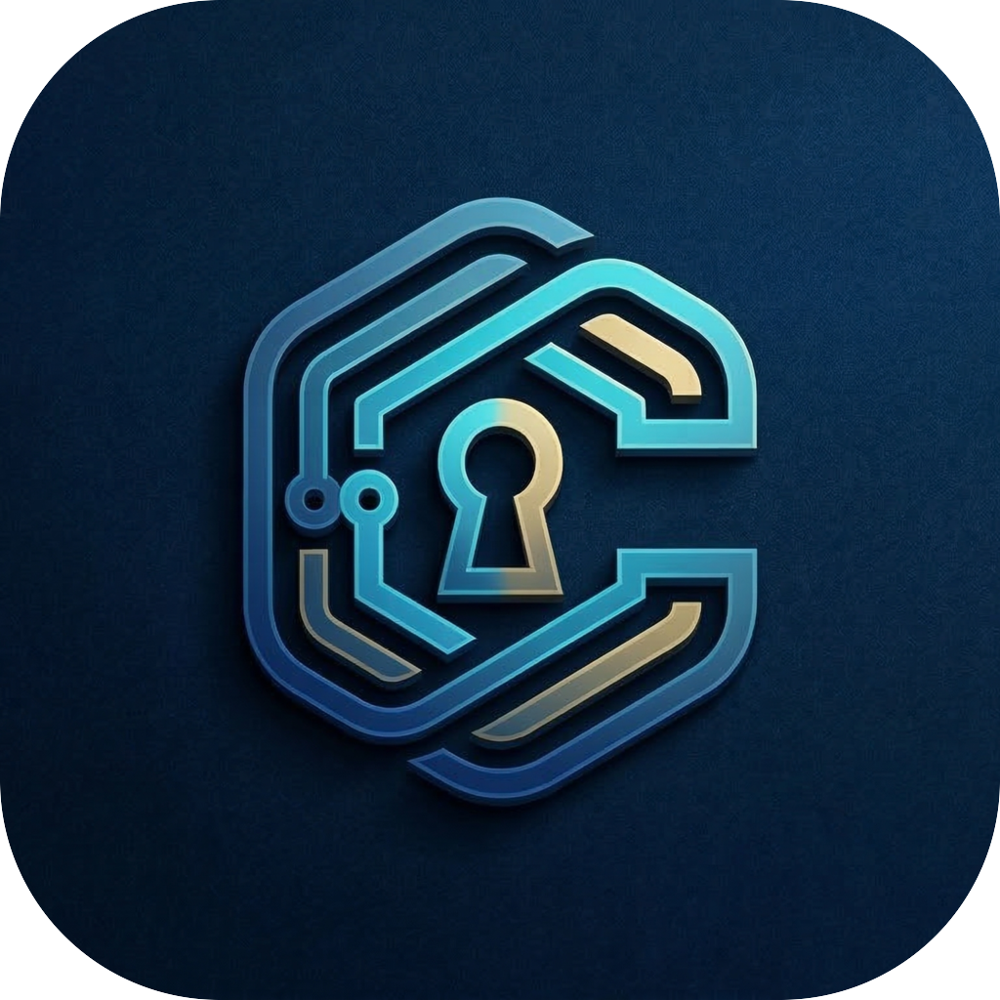
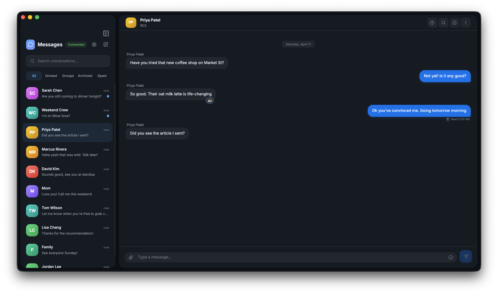
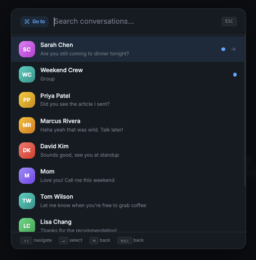
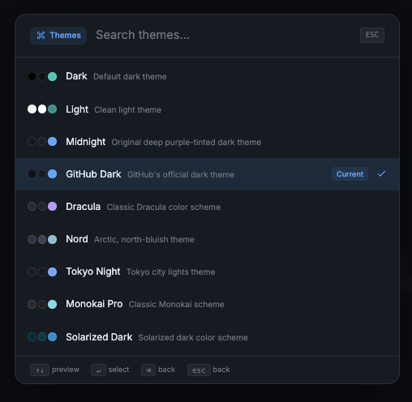
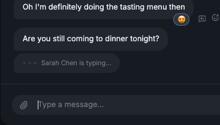
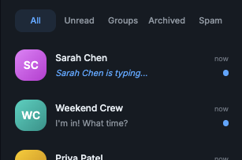
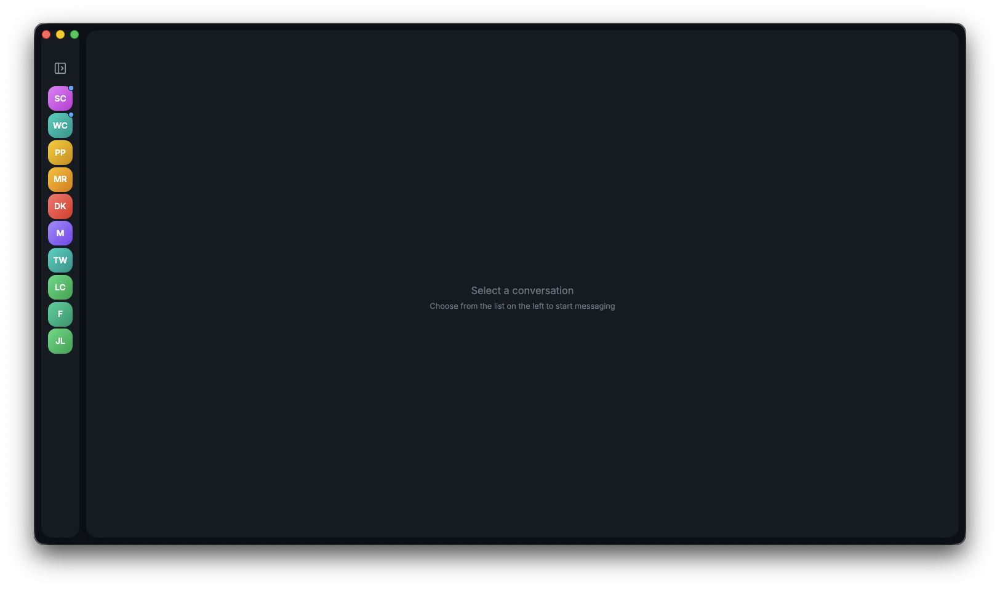
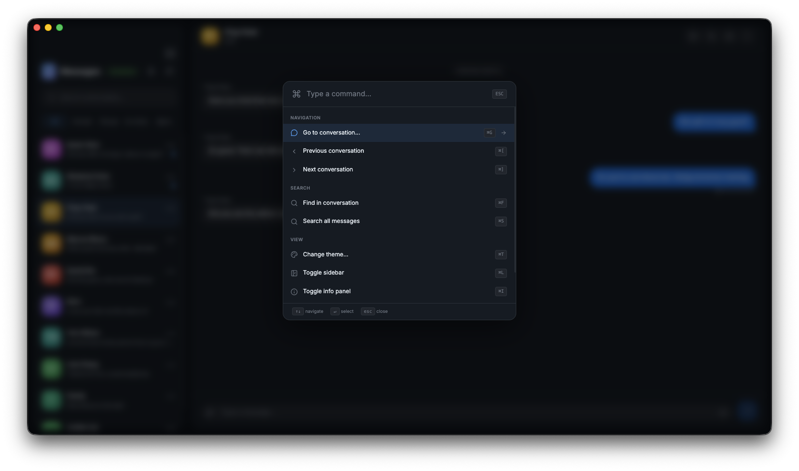

<p align="center">
  
</p>

<h1 align="center">Cipher</h1>

<p align="center">
  <strong>Text from your Mac using your Android phone</strong>
</p>

<p align="center">
  
  
  
</p>

<br />

> Cipher is a native macOS app that lets you send and receive text messages from your Mac through your Android phone — with native notifications, themes, keyboard-driven navigation, and a polished UI.

<br />

## Quick Start

If you just want to use Cipher, you do not need Go, Node.js, or any development setup.

1. Download the latest `Cipher.dmg` from the [Releases page](https://github.com/altjx/cipher/releases/latest).
2. Open the downloaded `.dmg` file.
3. Drag `Cipher.app` into your `Applications` folder.
4. Open `Cipher` from `Applications`.
5. If macOS warns that the app was downloaded from the internet, confirm that you want to open it.
6. When Cipher launches, scan the QR code with your Android phone to pair.

---

## Screenshots

<p align="center">
  
  <br />
  <em>Clean, native-feeling conversation view with reactions and read receipts</em>
</p>

<br />

<p align="center">
  
  <br />
  <em>Instantly jump to any conversation with <kbd>⌘</kbd><kbd>G</kbd></em>
</p>

<br />

<p align="center">
  
  <br />
  <em>9 built-in themes — switch instantly with <kbd>⌘</kbd><kbd>T</kbd></em>
</p>

<br />

<p align="center">
  
  
  <br />
  <em>Real-time typing indicators in conversations and the sidebar</em>
</p>

<br />

<p align="center">
  
  <br />
  <em>Collapse the sidebar for a focused view with <kbd>⌘</kbd><kbd>L</kbd></em>
</p>

<br />

<p align="center">
  
  <br />
  <em>Full keyboard-driven navigation with <kbd>⌘</kbd><kbd>K</kbd> command palette</em>
</p>

<br />

---

## Features

### Messaging
- Send and receive text, images, videos, PDFs, and vCards
- Reply to specific messages
- Emoji reactions with keyboard shortcuts (<kbd>⌘</kbd><kbd>X</kbd> then <kbd>1</kbd>–<kbd>7</kbd>)
- Delete sent messages
- Read receipts and delivery status indicators
- Real-time typing indicators
- Link detection with rich Open Graph previews
- Multi-file sending and drag-and-drop / paste-to-attach

### Conversations
- Filterable tabs: All, Unread, Groups, Archived, Spam/Blocked
- Full-text search across all messages (<kbd>⌘</kbd><kbd>S</kbd>)
- In-conversation search (<kbd>⌘</kbd><kbd>F</kbd>)
- Archive, mute, block, and delete conversations
- Contact search against your phone's full contact list
- Compose new messages to contacts or phone numbers (<kbd>⌘</kbd><kbd>N</kbd>)

### Media
- Inline image previews with full-size lightbox viewer and zoom
- Image gallery navigation with arrow keys
- Inline audio and video players
- Automatic audio transcoding via ffmpeg for browser compatibility
- Download any attachment
- Open images in native Preview app (macOS)

### Themes
9 built-in color themes with instant switching:

| Theme | Theme | Theme |
|---|---|---|
| Dark (teal) | Midnight (purple) | Light |
| GitHub Dark | Dracula | Nord |
| Tokyo Night | Monokai Pro | Solarized Dark |

### Keyboard-Driven
| Shortcut | Action |
|---|---|
| <kbd>⌘</kbd><kbd>K</kbd> | Command palette |
| <kbd>⌘</kbd><kbd>G</kbd> | Jump to conversation |
| <kbd>⌘</kbd><kbd>T</kbd> | Switch theme |
| <kbd>⌘</kbd><kbd>N</kbd> | New conversation |
| <kbd>⌘</kbd><kbd>L</kbd> | Toggle sidebar |
| <kbd>⌘</kbd><kbd>I</kbd> | Toggle info panel |
| <kbd>⌘</kbd><kbd>[</kbd> / <kbd>]</kbd> | Previous / next conversation (unread priority) |
| <kbd>⌘</kbd><kbd>F</kbd> | Find in conversation |
| <kbd>⌘</kbd><kbd>S</kbd> | Search all messages |
| <kbd>⌘</kbd><kbd>,</kbd> | Settings |
| <kbd>⌘</kbd><kbd>1</kbd>–<kbd>7</kbd> | Insert emoji |

### Desktop Integration (Electron)
- Native macOS notifications with configurable system sounds
- Dock badge for unread message count
- Click notification to jump to conversation
- Single-instance window management
- Automatic backend lifecycle management

### Detail Panel
- Conversation participants with avatars
- Copy phone numbers to clipboard
- Scrollable media gallery for images and files
- Group info with all participants

---

## Build From Source

### Prerequisites
- [Go](https://go.dev/) 1.26+
- [Node.js](https://nodejs.org/) 18+
- [ffmpeg](https://ffmpeg.org/) (for audio transcoding)

### Development

```bash
# 1. Start the backend
cd backend
go run .

# 2. Start the frontend dev server
cd frontend
npm install
npm run dev

# 3. (Optional) Launch in Electron
cd electron
npm install
npm run dev
```

Open your browser to `http://localhost:5173` or use the Electron window. Scan the QR code with your Android phone to pair.

---

## Architecture

```
┌──────────────────────────────────────────────┐
│                  Electron                     │
│  (spawns backend, proxies WS for notifs)      │
├──────────────────────────────────────────────┤
│           Frontend (React + Vite)             │
│  ← REST + WebSocket → │                      │
├────────────────────────┤                      │
│     Backend (Go)       │                      │
│  gorilla/mux · SQLite  │                      │
│         ↕              │                      │
│     libgm (RCS)        │                      │
└──────────────────────────────────────────────┘
```

The **Go backend** wraps [libgm](https://github.com/mautrix/gmessages) to pair with your Android phone and relay messages, exposes a REST + WebSocket API, and caches data in SQLite. The **React frontend** is a pure SPA that consumes the API. **Electron** manages the backend process, proxies WebSocket events for native notifications and dock badges, and loads the frontend.

---

## Acknowledgements

Cipher is built on top of [**mautrix-gmessages**](https://github.com/mautrix/gmessages) (libgm), an open-source Go library that implements the Google Messages pairing and RCS protocol. This project would not be possible without the incredible reverse-engineering work done by the mautrix team.

---

## License

This project is licensed under the [GNU Affero General Public License v3.0](LICENSE) — see the LICENSE file for details.
